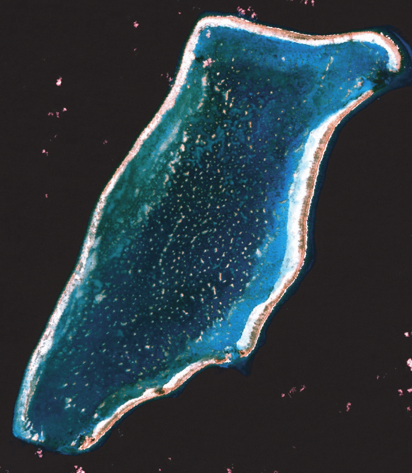
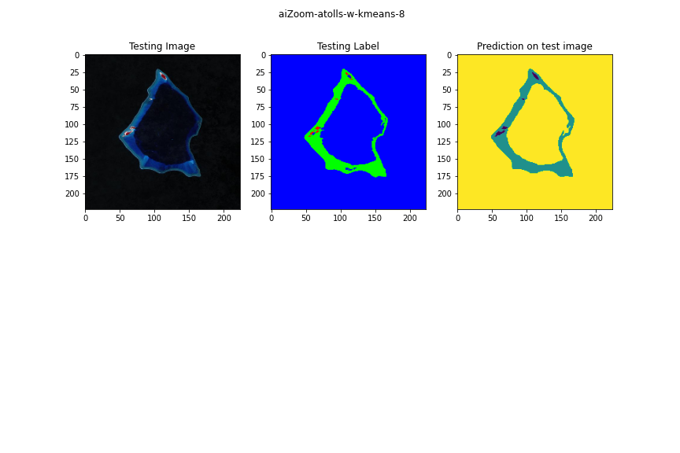
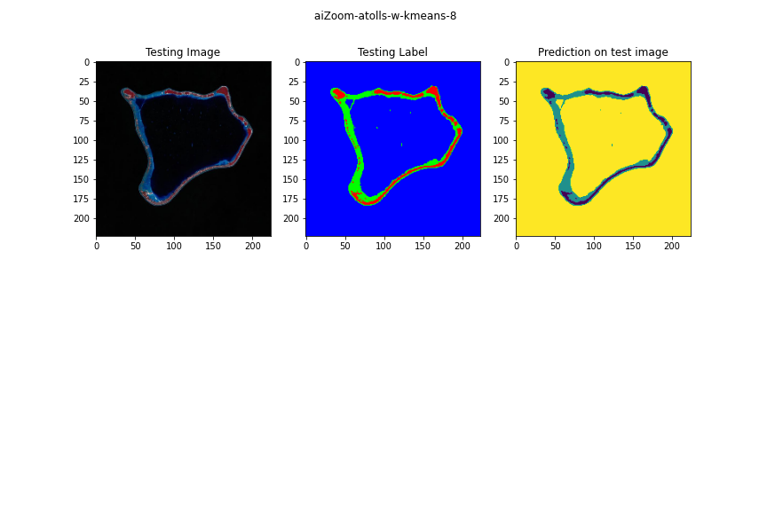

# ReefNet Pacific Atoll Segmentation using UNet Architecture

This project implements the ReefNet Pacific Atoll segmentation using the UNet architecture. The model is based on the work by Olaf Ronneberger et al. [1] and EhabR98 [2].

## Model Description

The model is a modified UNet architecture for semantic segmentation. It consists of a contraction path and an expansive path. The contraction path extracts features from the input images through a series of convolutional and pooling layers. The expansive path upsamples the features and combines them with the corresponding features from the contraction path through skip connections. The final output is obtained using a softmax activation function.

Please note that this model was not engineered by me. The model structure and utility functions were originally defined by Olaf Ronneberger, Philipp Fischer, and Thomas Brox in 2015 [1]. And the specific model is modified from the work from EhabR98 on github [2]. The code in this repository implements the model using the TensorFlow and Keras frameworks.

## Usage

### Local Implementation

To implement the model locally, follow these steps:

1. Set up your development environment with the required dependencies:
   - TensorFlow
   - Keras
   - NumPy
   - OpenCV
   - Pandas
   - Matplotlib

2. Prepare your dataset in the appropriate format. The input images and corresponding masks should be preprocessed and organized in the specified directory structure. The model performs best with filtered images or those captured in highly contrasting measurements.  

We used Near Infrared satellite images. 


Which looks a bit different than the RGB version:



3. Import the necessary libraries and define the model architecture from model.py.

```python
import model as mod
import os
import glob
import cv2
import numpy as np
from matplotlib import pyplot as plt
import pandas as pd
from sklearn.model_selection import train_test_split
from keras import backend as K
from sklearn.utils import class_weight
from keras.metrics import MeanIoU
```

4. Load your training and testing data using the appropriate functions or libraries. Preprocess the data as required, including resizing the images and normalizing the pixel values. The function loadData makes this much easier:

```python
loadData('path/to/imageDir', 'path/to/maskDir')
```
5. Augment data if necessary using the numpy arrays of your data.  We used rotation in all four 90 degree directions as other rotations led to a loss of pixel resolution and our data was alrady relatively low resolution: 

```python
augmentWithRotation(images, masks)
```

5. Compile the model by setting the optimizer, loss function, and evaluation metrics. This is streamlined with the function: trainModel().
NOTE: this function performs the entire pipeline, ie it formats data from directories, augments, and trains.

```python
trainModel()
```

6. Train the model using your training data. Adjust the batch size, number of epochs, and other parameters as needed. This can be done within trainModel function and within model.py.  The model will be saved to file after trainModel() is run.

7. Evaluate the model using your testing data. Calculate metrics such as accuracy, F1 score, and IoU to assess its performance. 

```python
evaluateModel(pathToModel, model, X_test, y_test)
```


### Google Colaboratory Implementation

To implement the model within a Google Colaboratory notebook, follow these steps:

1. Open the provided Colab notebook by clicking on the following link: [UNet_w_kmeans_labelsl8.ipynb](https://colab.research.google.com/github/gordoncd/ReefNet/blob/main/UNet_w_kmeans_labelsl8.ipynb)

2. Make sure you have a Google account and are signed in to Google Colaboratory.

3. Click the "Open in Colab" button at the top of the notebook to open it in Google Colaboratory.

4. Follow the instructions in the notebook to mount your Google Drive, set up directories, and install any required dependencies.

5. Copy the code provided in the notebook and run each cell sequentially. The notebook provides step-by-step guidance on data loading, preprocessing, model training, evaluation, and visualization.

6. Make sure to adjust any paths or parameters as needed to match your specific dataset and requirements.

7. After running all the cells, you will have a trained model and can evaluate its performance on the provided test set or your own test data.

8. You can also make predictions on new images using the trained model by providing the input image to the model and visualizing the predicted segmentation.

### Example Output:




## References

[1] Ronneberger, O., Fischer, P., & Brox, T. (2015). U-Net: Convolutional Networks for Biomedical Image Segmentation. In *Medical Image Computing and Computer-Assisted Intervention – MICCAI 2015* (pp. 234–241). Springer International Publishing.

[2] EhabR98. “EhabR98/Image_segmentation_Unet-Tutorial.” Accessed June 28, 2023. https://github.com/EhabR98/Image_segmentation_Unet-Tutorial.


---
